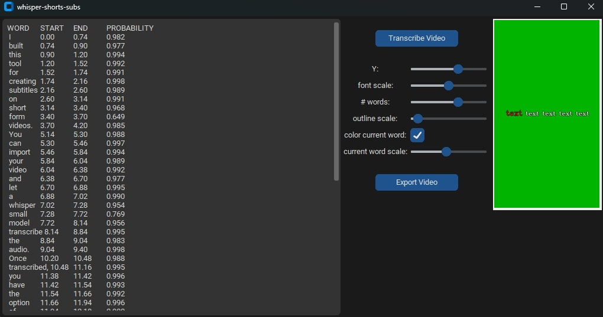

Whisper Shorts Subs
===================

A tool to add captions to mp4 videos. `Watch the video demo`_

.. _`Watch the video demo`: https://youtube.com/shorts/dEr7zBn1Uy8

It uses the whisper-small model to infer what is said in the video and the time stamps at which words are said to reduce the effort involved in making short-form videos.

Setup
-----

Note: upon first run, it will download the whisper-small model (~500MB). On Linux, it will download to ``~/.cache/huggingface/hub``. On Windows, it will download to ``C:\Users\username\.cache\huggingface\hub``

First, clone the repo:
``git clone https://github.com/RyanBaten/whisper-shorts-sub.git``

Then, pip install:
``pip install .``

On Linux systems, you will be able to run the entrypoint ``whisper-subs``. This entrypoint is not working out of the box yet on windows.

For Windows and Linux systems, you can use the run script ``python3 scripts/run_app.py``

Using
-----

This tool only works with mp4 videos at the moment.

- Load your video for transcription by hitting "Transcribe Video" and selecting your file.
- Edit the transcription in the text box to fix any mistakes.
- Use the preview box on the left and the sliders to determine how you want your text to show on the video.
- Hit "Export Video", choose a filename and destination, and your video will be generated.